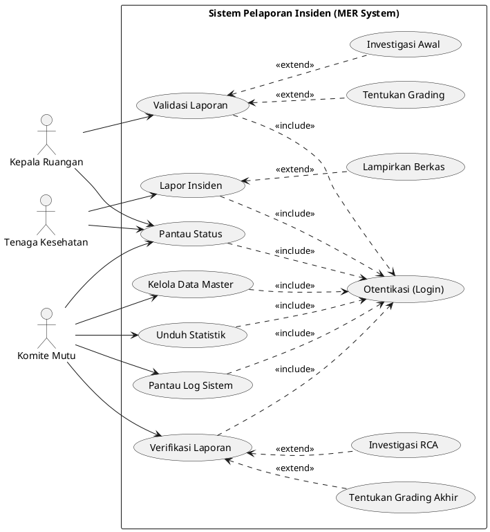

# Use Case Diagram: MER System

Berikut adalah representasi Use Case Diagram untuk Medical Error Reporting (MER) System menggunakan PlantUML, melibatkan 3 role utama (Tenaga Kesehatan, Kepala Ruangan, dan Komite), serta menerapkan konsep `<<include>>` dan `<<extend>>`.

